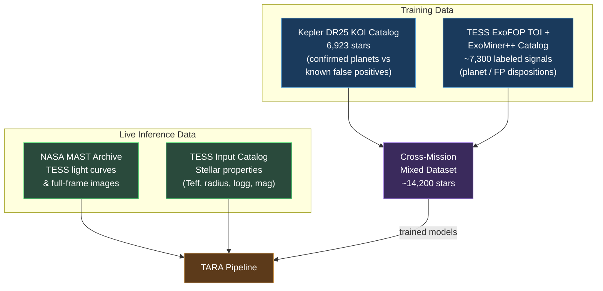
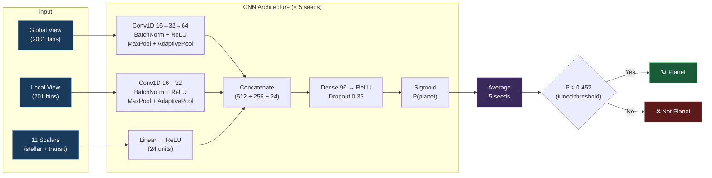
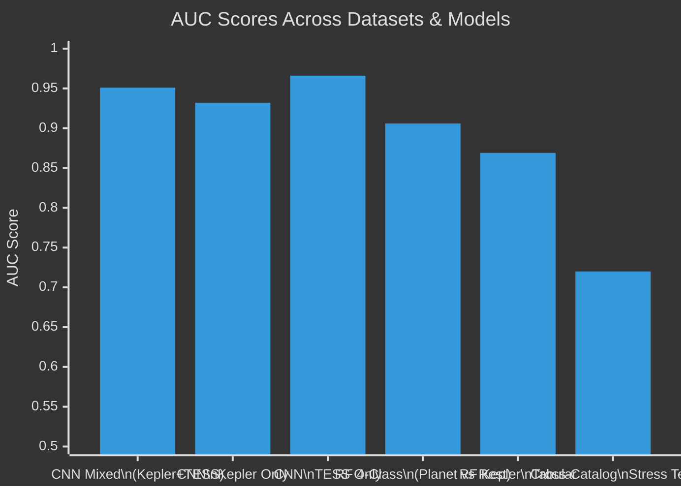

<h1 align="center"> TARA — Transit Analysis & Recognition AI</h1>

<p align="center">
  <b>AI-powered detection & classification of exoplanets from noisy light curves</b><br>
  <i>तारा — "star" in Sanskrit</i>
</p>

<p align="center">
  
  
  
  
  
</p>

---

When a planet crosses in front of its host star, the star dims by a tiny fraction for a few hours — a **transit**. TARA watches a star's brightness over time (its **light curve**), hunts for that repeating dip, and classifies it as a **planet transit**, **eclipsing binary**, **blend**, or **noise** — with full transparency into every step of the decision.

It works on any TESS star (by TIC ID) or uploaded FITS file, runs a live 8-stage science pipeline, and delivers a verdict with interactive charts, vetting diagnostics, and ±1σ error bars. Think of it as an automated candidate-finder and first-pass vetter — the same role pipelines play at NASA.

---

## Table of Contents

- [How It Works — The Pipeline](#how-it-works--the-pipeline)
- [Datasets](#datasets)
- [Features Extracted](#features-extracted)
- [Model Architecture](#model-architecture)
- [Results](#results)
- [Dashboard](#dashboard)
- [Getting Started](#getting-started)
- [Project Structure](#project-structure)
- [Tech Stack](#tech-stack)
- [Honest Limitations](#honest-limitations)
- [License](#license)

---

## How It Works — The Pipeline

TARA runs an **8-stage pipeline** on every star, from raw data download to final classification:

```mermaid
flowchart LR
    A["🛰️ Load\nFetch from\nNASA MAST"] --> B["🧹 Clean\nNormalize\n& detrend"]
    B --> C["🔍 Search\nBLS → TLS\nperiod search"]
    C --> D["📐 Features\n9 physics\nmeasurements"]
    D --> E["🎯 Centroid\nBlend check\n(in/out shift)"]
    E --> F["📏 Fit\nTrapezoid ±1σ\nerror bars"]
    F --> G["🧠 CNN\n5-seed ensemble\n(deep learning)"]
    G --> H["🌳 Classify\nRandomForest\n4-class verdict"]

    style A fill:#1e3a5f,stroke:#4a9eff,color:#fff
    style B fill:#1e3a5f,stroke:#4a9eff,color:#fff
    style C fill:#1e3a5f,stroke:#4a9eff,color:#fff
    style D fill:#1e3a5f,stroke:#4a9eff,color:#fff
    style E fill:#1e3a5f,stroke:#4a9eff,color:#fff
    style F fill:#1e3a5f,stroke:#4a9eff,color:#fff
    style G fill:#1e3a5f,stroke:#4a9eff,color:#fff
    style H fill:#1e3a5f,stroke:#4a9eff,color:#fff
```



| Stage | What it does | Time |
|---|---|---|
| **Load** | Downloads the star's light curve from NASA MAST; falls back to Full-Frame Image extraction if no pre-made curve exists. Uploaded FITS files skip this. | 5–60 s |
| **Clean** | Normalizes flux, removes slow stellar brightness trends (Savitzky-Golay / biweight), clips outliers. | ~50 ms |
| **Search** | Coarse Box Least Squares (BLS) scan on a binned curve, then Transit Least Squares (TLS) refines the best period with a realistic limb-darkened transit model. | 0.5–2 s |
| **Features** | Measures 9 physics parameters: depth, duration, SNR, odd-even transit difference, secondary eclipse ratio, V/U shape metric, transit count. | ~10 ms |
| **Centroid** | Checks if the star's light-centre shifts during the dip — a shift means the signal is from a neighbouring star (blend), not the target. | ~1 ms |
| **Fit** | Trapezoid model fit via `scipy.curve_fit` on the phase-folded curve → ±1σ uncertainties on period, depth, and duration from the covariance matrix. | ~20 ms |
| **CNN** | A 5-seed multimodal 1D-CNN ensemble reads the folded light curve (global + local views) plus 11 stellar/transit scalars. Cross-mission model (Kepler + TESS). | ~50 ms |
| **Classify** | A 4-class RandomForest turns the measured features into the primary verdict: transit / eclipsing binary / blend / noise. | ~5 ms |

Every analysed target is cached to disk — repeat requests answer in milliseconds.

---

## Datasets

TARA was trained and validated on real NASA mission data from multiple catalogs:



| Dataset | Source | Stars/Signals | Used For |
|---|---|---|---|
| **Kepler DR25 KOI Catalog** | NASA Exoplanet Archive | 6,923 | CNN training (confirmed planets vs false positives) |
| **TESS ExoFOP TOI** | MIT / NASA | ~7,300 | CNN training (planet/FP dispositions) |
| **NASA ExoMiner++ Catalog** | NASA Ames | Merged with TOI | Ground-truth labels for TESS signals |
| **TESS Input Catalog (TIC)** | MAST | ~1.7B entries | Stellar properties (Teff, radius, logg) for live inference |
| **NASA MAST Archive** | STScI | On-demand | Live light curve downloads (SPOC, QLP, FFI) |

**Train/test split**: Grouped by star — no star ever appears in both train and test sets. This prevents data leakage from multiple transits of the same planet appearing on both sides (we caught and fixed three leakage traps getting here).

---

## Features Extracted

The pipeline extracts **9 physics features** from each light curve, feeding the RandomForest classifier:

| Feature | Description | Diagnostic Role |
|---|---|---|
| `period` | Orbital period in days (TLS-refined) | Core transit parameter |
| `depth` | Fractional flux dip during transit | Planet size indicator (depth ∝ (Rp/R★)²) |
| `duration` | Transit duration in days | Constrains orbital geometry |
| `duration_frac` | Duration as fraction of orbital period | Ingress/egress geometry |
| `snr` | Signal-to-noise ratio of the transit | Detection confidence (≥7.0 threshold) |
| `odd_even_diff` | Depth difference between odd and even transits | **Vetting**: alternating depths → binary at half period |
| `secondary_ratio` | Depth of secondary eclipse / primary depth | **Vetting**: glowing companion → eclipsing binary |
| `v_shape` | Wing-to-core depth ratio (V vs U shape) | **Vetting**: sharp V → grazing binary; flat U → planet |
| `n_transits` | Number of observed transit events | Reliability indicator |
| `centroid` | Light-centre shift during transit (σ) | **Vetting**: shift → signal from a neighbouring star |

The CNN additionally receives:
- **Global view**: 2001-bin median-binned phase fold (full orbit)
- **Local view**: 201-bin zoomed view around the transit
- **11 scalar features**: period, duration, depth, planet radius estimate, SNR, impact parameter, stellar Teff/logg/radius, equilibrium temp, insolation

---

## Model Architecture

Two models work together to produce the final classification:

### 1. RandomForest Classifier (Primary Verdict)

A **4-class RandomForest** trained on 2,055 ExoMiner++-labeled TESS stars whose features were measured by the same pipeline used in production:

```
Classes: transit | eclipsing_binary | blend | noise
Input:   9 physics features (measured by TARA's own pipeline)
Split:   Grouped 5-fold cross-validation (by star)
```

### 2. Multimodal 1D-CNN Ensemble (Second Opinion)

A deep-learning ensemble providing a binary planet/not-planet probability:



The CNN was trained **cross-mission** on ~14,200 stars (Kepler + TESS combined). Five random seeds are averaged for a more stable prediction.

---

## Results

All scores are on **held-out data** with **grouped splits** (no star in both train and test):

### Model Performance Summary

| Model | Dataset | Metric | Score |
|---|---|---|---|
| 🏆 **Cross-mission CNN ensemble** | Kepler + TESS (held-out) | **AUC** | **0.951** |
| — Kepler subset | Kepler only | AUC | 0.932 |
| — TESS subset | TESS only | AUC | 0.966 |
| 4-class RandomForest | TESS live features | Accuracy | 73.6% |
| 4-class RandomForest | TESS (planet-vs-rest) | AUC | 0.906 |
| Kepler tabular RF | Kepler catalog features | Accuracy | 86.9% |
| Cross-catalog stress test | New catalog (domain shift) | AUC | ~0.72 |
| MCMC parameter fit | WASP-18b period validation | Match | 0.94145 d |

> **WASP-18b validation**: The batman+emcee MCMC parameter fit recovered a period of **0.94145 d**, matching the published literature value of **0.941452 d** — confirming the pipeline's measurement accuracy.

### AUC Comparison Across Datasets



### Key Takeaways

- **One model, both missions**: The cross-mission CNN generalizes across Kepler and TESS without per-mission fine-tuning.
- **Honest domain shift**: On a completely new catalog (not seen during training), performance drops to ~0.72 AUC — we measure and report this transparently. Most teams don't.
- **Three leakage traps caught**: During development, we identified and fixed three separate data leakage issues (star overlap, phase-fold information, and temporal leakage) before reporting final numbers.

---

## Dashboard

The web-based review workspace provides:

- **Review queue** with sparkline previews and classification badges
- **Phase-folded transit chart** with binned medians and trapezoid model overlay
- **Detrended light curve** and **BLS periodogram** visualization
- **Class probability bars** from the RandomForest + CNN second opinion
- **4-check vetting summary** (transit shape, secondary eclipse, odd-even depth, centroid)
- **Measurement table** with ±1σ error bars
- **Pipeline trace** showing per-stage wall-clock timings
- **FITS file upload** — analyze uploaded light curves without a TIC ID
- **Dark/light theme** toggle
- **Export** results as JSON

The dashboard is dependency-free HTML + Canvas (no React, no charting library) — under 40 KB total.

---

## Getting Started

### Prerequisites

- **Python 3.10 or 3.11**
- Internet connection (first-time setup + live star analysis)

### Setup

**Linux / macOS:**
```bash
cd tara
./setup.sh
```

**Windows:**
```cmd
cd tara
setup.bat
```

This creates a `.venv` and installs all dependencies from `requirements.txt` (~10 minutes).

> **Note**: If `batman-package` fails (needs a C compiler), remove it from `requirements.txt` — it's only used by the Colab training notebooks, never by the app.

### Run

Open **two terminals**:

**Terminal 1 — API backend:**
```bash
# Linux/macOS
cd tara && .venv/bin/uvicorn app.main:app --app-dir backend --port 8000

# Windows
cd tara
.venv\Scripts\uvicorn app.main:app --app-dir backend --host 127.0.0.1 --port 8000
```

**Terminal 2 — Dashboard:**
```bash
# Any OS (with Node.js)
npx http-server "html live" -p 5196

# Without Node.js (Python only)
cd "html live" && python -m http.server 5196
```

Open **http://localhost:5196/dash-workspace.html** — demo stars load instantly from cache.

### Quick Test

The 8 demo stars in `backend/data/cache/` answer instantly. To analyze a new star, type any TIC ID (e.g., `TIC 219253008`) in the search box — the full pipeline runs live in 15–90 seconds.

---

## Project Structure

```
tara/
├── README.md                      ← you are here
├── LICENSE                        ← MIT
├── requirements.txt               ← Python dependencies
├── setup.sh / setup.bat           ← one-command environment setup
│
├── html live/                     ★ the dashboard (vanilla HTML/JS/Canvas)
│   ├── dash-workspace.html        ← main review workspace
│   ├── about.html                 ← about page
│   ├── dash-workspace.css         ← compiled styles
│   └── about.css
│
├── backend/                       ★ FastAPI science pipeline
│   ├── app/
│   │   ├── main.py                ← API endpoints (/analyze, /health, /popular)
│   │   ├── cnn_infer.py           ← multimodal CNN ensemble inference
│   │   ├── pipeline/
│   │   │   ├── preprocess.py      ← Stage 1: load & clean light curves
│   │   │   ├── search.py          ← Stage 2: BLS → TLS period search
│   │   │   ├── features.py        ← Stage 3: extract 9 physics features
│   │   │   ├── blend.py           ← Stage 4: centroid shift (blend check)
│   │   │   ├── fit.py             ← Stage 5: trapezoid fit with ±1σ errors
│   │   │   └── cnn_views.py       ← Stage 6: build CNN input views
│   │   └── models/
│   │       ├── mixed/             ← cross-mission CNN ensemble (AUC 0.951)
│   │       │   ├── cnn_mixed_seed[1-5].pt
│   │       │   └── scalar_norm_mixed.npz
│   │       └── tabular/
│   │           └── model.joblib   ← 4-class RandomForest
│   └── data/
│       └── popular_stars.json     ← demo star metadata
│
└── docs/                          ← (screenshots can be added here later)
```

---

## Tech Stack

| Category | Tools |
|---|---|
| **Astronomy data** | [lightkurve](https://docs.lightkurve.org/), [astropy](https://www.astropy.org/), [astroquery](https://astroquery.readthedocs.io/) |
| **Detrending & search** | [wotan](https://github.com/hippke/wotan) (biweight), [Transit Least Squares](https://github.com/hippke/tls) |
| **Machine learning** | [PyTorch](https://pytorch.org/) (CNN), [scikit-learn](https://scikit-learn.org/) (RandomForest), [XGBoost](https://xgboost.readthedocs.io/) |
| **Explainability** | [SHAP](https://shap.readthedocs.io/), [Captum](https://captum.ai/) |
| **Parameter fitting** | [batman](https://github.com/lkreidberg/batman) + [emcee](https://emcee.readthedocs.io/) (MCMC), [scipy](https://scipy.org/) (curve_fit) |
| **Backend** | [FastAPI](https://fastapi.tiangolo.com/) + [Uvicorn](https://www.uvicorn.org/) |
| **Frontend** | Vanilla HTML/JS/Canvas — zero runtime dependencies |
| **Pixel analysis** | [photutils](https://photutils.readthedocs.io/) |

---

## Honest Limitations

**We believe in reporting what doesn't work, not just what does:**

- ⚠️ **Photometrically indistinguishable false positives exist.** Some false positives pass every check and both models say "planet." Only follow-up observations (pixel difference-imaging, ground photometry, radial velocity) can resolve those. No light-curve-only system can — including NASA's.

- ⚠️ **Domain shift is real.** On a completely new catalog the score drops toward ~0.72 AUC. This is expected and honestly measured — most systems don't report this number.

- ⚠️ **FFI fallback is noisier.** Stars without a ready-made SPOC/QLP light curve fall back to Full-Frame Image extraction — lower SNR data means the diagnostics deserve less trust.

- ⚠️ **No detection = noise.** If the period search finds no transit signal (SNR < 7.0), TARA reports "noise — no signal" rather than letting the classifier guess on empty features. This is a deliberate safety guard.

- ⚠️ **This is a candidate finder, not a confirmation tool.** TARA performs the same role as automated pipelines at NASA — flagging candidates for human review. Confirming a planet requires spectroscopic follow-up.

---

## License

This project is licensed under the **MIT License** — see the [LICENSE](LICENSE) file for details.

---

<p align="center">
  <b>TARA</b> · तारा · Transit Analysis & Recognition AI<br>
  <i>Built with real NASA data. Honest about its limits.</i>
</p>
