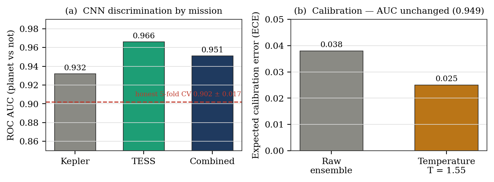
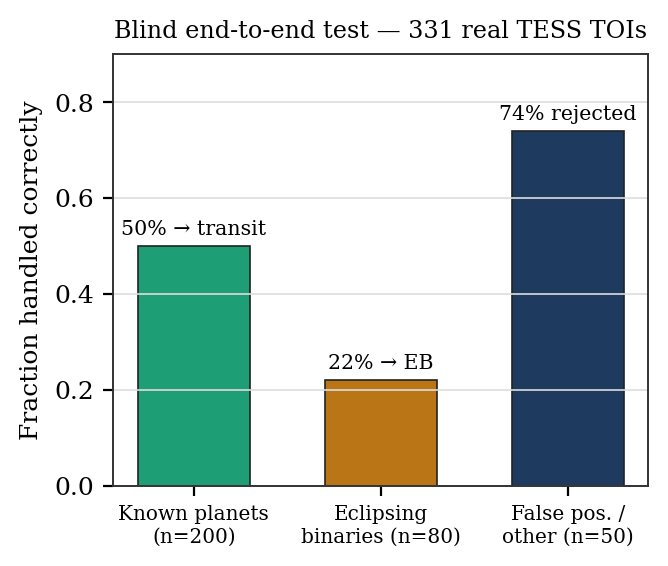

# TARA — Transit Analysis & Recognition AI

> An AI system that **detects and classifies exoplanet transits** in noisy TESS light curves — end to end, from a raw star to an honest verdict.

`Python 3.10+` · `FastAPI` · `PyTorch (CNN)` · `scikit-learn (RandomForest)` · `lightkurve` · `Transit Least Squares`

---

## Contents
1. [The problem](#1-the-problem)
2. [How TARA works — the pipeline](#2-how-tara-works--the-pipeline)
3. [The two models](#3-the-two-models)
4. [How the scoring works](#4-how-the-scoring-works)
5. [Datasets](#5-datasets)
6. [Results (honest)](#6-results-honest)
7. [Codebase](#7-codebase)
8. [Setup & run](#8-setup--run)
9. [Honesty guards](#9-honesty-guards)
10. [Limitations & future work](#10-limitations--future-work)

---

## 1. The problem

Space telescopes like **TESS** and **Kepler** watch a star's brightness over time, looking for the tiny, repeating dip that happens when a planet crosses ("transits") in front of it. The trouble is that the dip is shallow — a Jupiter is about a **1%** dip, an Earth closer to **0.01%** — and it competes with instrument noise, stellar wobble, and, worst of all, **impostors**: eclipsing binary stars and background blends that mimic a planet.

TARA takes a raw light curve and answers two questions end to end:

- **Detection** — is there a real, repeating transit-like dip above the noise?
- **Classification** — is it a **transit** (planet), an **eclipsing binary**, a **blend**, or just **noise**? — with a calibrated confidence, and an honest *"uncertain"* when the evidence is weak.

Unlike most published models (AstroNet, ExoMiner), which classify signals a *separate* pipeline already found, TARA does **both the search and the classification itself**.

---

## 2. How TARA works — the pipeline

A single search runs through eight stages:

<p align="center"></p>

| Stage | File | What it does |
|------|------|--------------|
| 1 · Ingest | `pipeline/preprocess.py` | Download the light curve from NASA MAST (or accept an uploaded FITS/CSV) |
| 2 · Detrend | `pipeline/preprocess.py` | Savitzky–Golay flatten to remove slow stellar/instrument trends |
| 3 · Search | `pipeline/search.py` | Coarse **Box Least Squares** scan → **Transit Least Squares** refine to find the period |
| 4 · Features | `pipeline/features.py` | Compute the **12 physics features** |
| 5 · Fit | `pipeline/fit.py` | Trapezoid transit fit with ± error bars |
| 6 · Blend | `pipeline/blend.py` | Centroid / dilution checks for background contamination |
| 7 · Classify | `cnn_infer.py` + `models/` | Run **both** models — the CNN and the RandomForest |
| 8 · Guards | `main.py` | Enforce a detection floor and emit an honest verdict |

The whole backend is about **1,000 lines of Python**; the intelligence lives in the two trained models.

---

## 3. The two models

TARA deliberately uses two models that look at the candidate in different ways, then combines them:

| Model | Type | Reads | Answers |
|-------|------|-------|---------|
| **CNN** (5-seed ensemble) | Binary | the raw phase-folded light curve | "how planet-shaped is this?" → **P(planet)** |
| **RandomForest v3.1** | 4-class (400 trees) | the 12 physics features | "*what kind* of thing is it?" → transit / eclipsing binary / blend / noise |

The CNN is the **data-driven eye** (it learns the shape); the RandomForest is the **physics-driven brain** (it reasons over measurable quantities like depth, duration, and secondary eclipses). The dashboard shows both, and the guards decide the final label.

---

## 4. How the scoring works

**RandomForest (the 4-class verdict).** The 12 features go into 400 decision trees; the forest returns a probability for each of the four classes, and the highest one becomes the label (its value is the confidence). The features are physically meaningful, and the model's own importance ranking — read straight from the trained forest — matches what a human vetter would weigh most: transit **depth**, **duration fraction**, **SNR** and **period** lead.

<p align="center"></p>

**CNN (the planet-shape score).** The folded light curve is fed to five independently trained networks; their outputs are averaged in logit space, then passed through a **temperature calibration** (T = 1.55) so the confidence number is trustworthy — this lowers calibration error (ECE) from 0.038 to 0.025 **without changing the ranking (AUC)**.

**How we measure the score (AUC).** AUC is the probability the model ranks a real planet above a random non-planet. It is measured on a **held-out, grouped split** (no star appears in both training and test, so the model can't cheat by memorising a star). The CNN is scored planet-vs-not; the RandomForest planet-vs-rest.

<p align="center"></p>

**Guards turn a score into an honest verdict.** A signal is only "detected" if it clears **SNR ≥ 7**; a verdict is only "confident" if the top class probability ≥ 0.40 **and** it beats the runner-up by ≥ 0.10 — otherwise the UI says *uncertain* instead of guessing.

---

## 5. Datasets

Every training example needs three things, joined by star ID (**TIC** for TESS, **KIC** for Kepler): a **label** (what it is), an **ephemeris** (period + epoch, to fold the curve), and a **light curve** (the flux). Labels come from vetted catalogues; flux comes from NASA MAST via `lightkurve`.

<p align="center"></p>

| Source | Role |
|--------|------|
| ExoMiner-derived labelled TCE catalogue (TESS) | labels + ephemerides |
| Kepler DR25 KOI dispositions | labels |
| TOI catalogue (ExoFOP, 8,064 objects) | labels |
| NASA MAST light curves (SPOC / TESS-SPOC, single sector) | the flux, pulled with `lightkurve` |

These feed two training sets: **~14,000 folded views** for the CNN and **5,950 twelve-feature rows** for the RandomForest.

- **Not usable for training:** the TIC / Candidate Target List star catalogues — they contain neither dispositions nor light curves.
- **One key data decision (variant B):** Kepler's 30-minute cadence smears transit edges. Including those transits taught the model a soft transit shape that transferred poorly to TESS's sharp 2-minute cadence, so they were **excluded** from the transit class — this alone raised planet-vs-rest AUC from 0.906 to **0.953**.

---

## 6. Results (honest)

| What | Metric | Score |
|------|--------|-------|
| CNN ensemble (planet vs not) | ROC AUC | **0.951** — Kepler 0.932 / TESS 0.966 |
| CNN — honest floor | 5-fold cross-validation | **0.902 ± 0.017** |
| CNN — calibration | ECE | 0.038 → **0.025** (AUC unchanged) |
| RandomForest v3.1 (4-class) | grouped accuracy | **75.8%** |
| RandomForest — planet vs rest | ROC AUC | **0.953** |
| RandomForest — transit class | precision / recall | 0.76 / 0.69 |
| RandomForest — blend (hardest) | recall | 0.67 |

**Blind end-to-end test** on 331 real TESS Objects of Interest:

<p align="center"></p>

Half of known planets are recovered end to end, 74% of false positives are rejected, and EB recall (22%) reflects domain shift from mostly-Kepler EB training. **The honest headline:** of the planets *not* recovered, most are lost at the **detection** front-end (the single-sector SNR ≥ 7 floor), **not** by the classifier — given a detected signal, TARA labels it correctly the large majority of the time. So the ~0.95 classification AUC and the 50% end-to-end number are measuring two different, both-honest things.

---

## 7. Codebase

```
tara/                              (this folder = the repository root)
├── backend/
│   ├── app/
│   │   ├── main.py                FastAPI app + orchestration + honesty guards (4 endpoints)
│   │   ├── cnn_infer.py           CNN ensemble inference (5 seeds + temperature calibration)
│   │   ├── pipeline/
│   │   │   ├── preprocess.py      MAST download, detrend, zero-centred-flux guard
│   │   │   ├── search.py          BLS coarse scan → TLS refine (period search)
│   │   │   ├── features.py        the 12 physics features
│   │   │   ├── fit.py             trapezoid transit fit + uncertainties
│   │   │   ├── blend.py           centroid / dilution (blend) check
│   │   │   └── cnn_views.py       build phase-folded views for the CNN
│   │   ├── models/
│   │   │   ├── tabular/model.joblib          RandomForest v3.1 (400 trees, 12 features, 4 classes)
│   │   │   └── mixed/cnn_mixed_seed{1..5}.pt + scalar_norm_mixed.npz + calibration.json
│   ├── data/                      10 demo star caches + popular_stars.json
│   └── train/                     dataset-build + training scripts
├── frontend/                      the dashboard — dash-workspace.html + about.html
│                                  (vanilla HTML/CSS/JS + compiled Tailwind, no build server)
├── notebooks/                     Colab / Kaggle training notebooks (how the models were built)
├── docs/                          architecture.md · research paper (PDF) · RUN-ON-WINDOWS · assets/
├── start/                         setup.sh · setup.bat  (environment setup)
└── requirements.txt · quickstart.py · dev_check.py
```

**API endpoints** (FastAPI, `backend/app/main.py`):

| Method | Endpoint | Purpose |
|--------|----------|---------|
| `GET`  | `/health` | liveness + which models loaded |
| `GET`  | `/popular` | precomputed demo stars (instant) |
| `POST` | `/analyze` | analyze a star by TIC id |
| `POST` | `/analyze-file` | analyze an uploaded FITS/CSV light curve |

---

## 8. Setup & run

```bash
# 1. one-time setup (needs internet)
./start/setup.sh      # macOS/Linux   ·   Windows: start\setup.bat
# (equivalent to: python3 -m venv .venv && .venv/bin/pip install -r requirements.txt)
```

```bash
# 2. quick sanity check — downloads one known planet host, runs a transit search
.venv/bin/python quickstart.py
```

```bash
# 3. start the backend API
.venv/bin/uvicorn app.main:app --app-dir backend --port 8000
```

```bash
# 4. serve the dashboard (separate terminal), then open dash-workspace.html
npx http-server frontend -p 5196
# → http://localhost:5196/dash-workspace.html
```

The dashboard auto-detects the backend (localhost / same-origin) and pings its health every 20s, so you can see whether the engine is live.

---

## 9. Honesty guards

TARA is built to **abstain rather than fabricate** a verdict on bad input. Three guards enforce this:

- **Detection floor** — a signal must clear **SNR ≥ 7** to count as detected; below that the star is reported as *no detected signal*, not a coin-flip.
- **Zero-centred-flux guard** — corrupt or already-normalised products (median ≤ 0) are rejected with a clear message instead of producing garbage features.
- **Confident flag** — a label is only shown as confident when the top probability ≥ 0.40 **and** the margin over the runner-up ≥ 0.10; otherwise the UI shows *uncertain*, and the CNN reading is suppressed when there is no real signal to read.

---

## 10. Limitations & future work

- **Detection is the bottleneck**, not the classifier — single-sector search caps end-to-end recovery. The highest-value next step is a "**classify pre-detected TCEs**" mode that skips the search (expected recovery 50% → 75–85%).
- **EB recall** on real TESS is depressed by training mostly on Kepler EBs (domain shift) — fix by adding the **TESS Eclipsing Binary catalogue** and **Kepler Certified-False-Positive** flags.
- **Blend** is the data-starved class (recall 0.67) — the same new label sources help.
- **Batch mode** — TLS search is CPU-heavy; multi-sector stitching + offline batch would scale it.
- A **difference-imaging / pixel branch** is the real modality gap to ExoMiner.

---

*TARA — Transit Analysis & Recognition AI. Detects and classifies exoplanet transits in noisy TESS light curves.*
