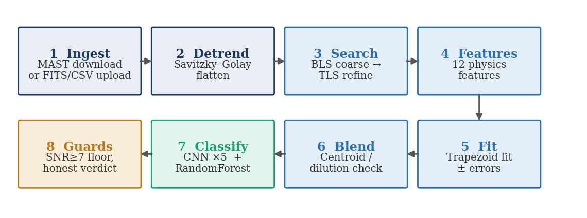
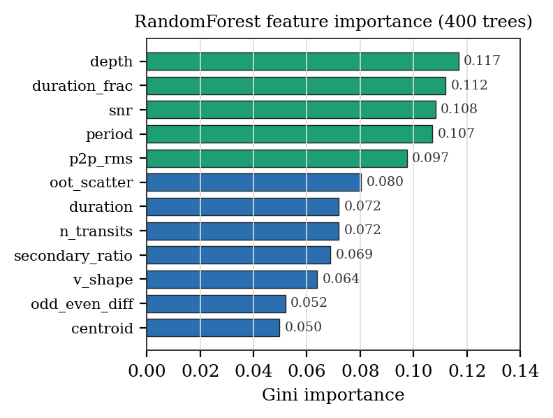
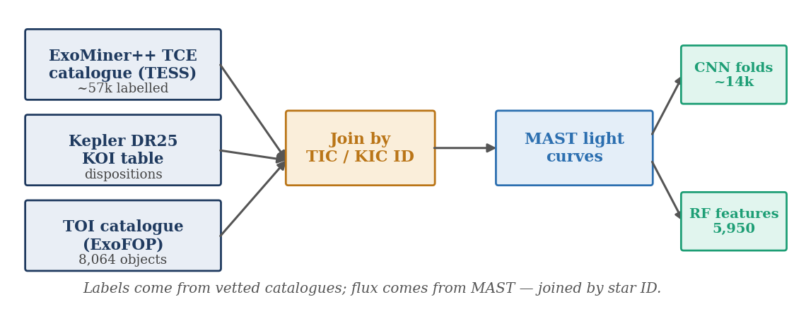

# TARA — Technical Architecture

*Transit Analysis & Recognition AI — detects and classifies exoplanet transits in noisy TESS light curves.*

This document describes how TARA is actually built: the data flow, the two-model classifier, the module layout, the API, and the key design decisions. For a quick start see the top-level [README](../README.md); for the full write-up see the research paper in this folder (`TARA-research-paper.pdf`).

---

## 1. Overview

TARA takes a raw light curve — a star's brightness over time — and answers two coupled questions end to end:

- **Detection** — is there a real, repeating transit-like dip above the noise?
- **Classification** — is it a planetary **transit**, an **eclipsing binary**, a **blend**, or **noise**? — with a calibrated confidence and an explicit *uncertain* state.

Unlike classifiers such as AstroNet or ExoMiner, which label signals a *separate* pipeline already detected, TARA runs **both the search and the classification itself**. The backend is ~1,000 lines of Python; the intelligence lives in two trained models.

---

## 2. Data flow: raw light curve → verdict

A single analysis runs through eight stages.

<p align="center"></p>

| # | Stage | Module | Responsibility |
|---|-------|--------|----------------|
| 1 | Ingest | `pipeline/preprocess.py` | Download the light curve from NASA MAST via `lightkurve` (author preference SPOC → TESS-SPOC → QLP), or accept an uploaded FITS/CSV. Empty-search retry, corrupt-file deletion, FFI (TESScut) fallback. |
| 2 | Detrend | `pipeline/preprocess.py` | Savitzky–Golay flatten (window 401) to remove slow stellar/instrument trends. Zero-centred-flux guard rejects corrupt products. |
| 3 | Search | `pipeline/search.py` | Coarse **Box Least Squares** on 10-minute-binned flux → **Transit Least Squares** refine within ±3% to lock period, epoch, duration. |
| 4 | Features | `pipeline/features.py` | Compute the 12 physics features (see §4). |
| 5 | Fit | `pipeline/fit.py` | Trapezoid transit fit on the folded curve → depth / duration / period with ±1σ error bars. |
| 6 | Blend | `pipeline/blend.py` | Centroid-motion / dilution checks — is the dip coming from a neighbouring star? |
| 7 | Classify | `cnn_infer.py` + `models/` | Run **both** models: the 5-seed CNN ensemble and the 4-class RandomForest. |
| 8 | Guards | `main.py` | Enforce the detection floor and confidence gate, then emit an honest verdict (§5). |

The result is a JSON payload with the light curve, periodogram, phase-fold (dense scatter + binned medians), both models' raw outputs, per-stage timings, and the final verdict.

---

## 3. The two-model classifier

TARA deliberately looks at each candidate two ways and combines them:

| Model | Type | Input | Output |
|-------|------|-------|--------|
| **CNN** (5-seed ensemble) | Binary | the raw phase-folded light curve | **P(planet)** — "how planet-shaped is this?" |
| **RandomForest v3.1** | 4-class (400 trees) | the 12 physics features | transit / eclipsing binary / blend / noise — "*what kind* of thing is it?" |

**CNN — the data-driven eye.** A 1-D convolutional network reads the amplitude-normalised folded flux directly. Five independently seeded networks are averaged in *logit* space, then passed through **temperature scaling** (T = 1.55) so the confidence number is trustworthy — this lowers calibration error (ECE) from 0.038 to 0.025 while leaving the ranking (AUC) unchanged. The head is a single sigmoid output (planet vs not).

**RandomForest — the physics-driven brain.** 400 trees classify all four categories from the 12 interpretable features. Trained on **5,950** feature rows (variant B — Kepler long-cadence transits excluded, see §11), scored on a **grouped hold-out** so no star appears in both train and test.

The dashboard shows both; the guards (§5) decide the final label. The RandomForest is the primary 4-class verdict; the CNN is the second opinion on whether the signal is planetary at all.

---

## 4. The 12 features

Read directly from the trained model (`model["features"]`), grouped by what they capture:

| Group | Features |
|-------|----------|
| Transit **shape** | `depth`, `duration`, `duration_frac`, `v_shape` |
| Signal **significance** | `snr`, `n_transits`, `period` |
| False-positive **discriminators** | `odd_even_diff`, `secondary_ratio`, `centroid` |
| **Noise** descriptors | `oot_scatter`, `p2p_rms` |

The forest's own Gini importances put transit `depth` (0.117), `duration_frac` (0.112), `snr` (0.108) and `period` (0.107) at the top — the same quantities a human vetter weighs first.

<p align="center"></p>

---

## 5. Honesty guards

Two models are not enough if the input is junk. Three guards make TARA **abstain rather than fabricate**:

- **Detection floor** — a signal must clear **SNR ≥ 7** (a field-standard threshold) to count as detected; below that the star is reported as *no detected signal*, and the classifier is not asked to guess on empty features.
- **Zero-centred-flux guard** — products whose flux median ≤ 0 (corrupt or already-normalised) are rejected with a clear message.
- **Confident flag** — a verdict is only "confident" when the top class probability ≥ **0.40** *and* it beats the runner-up by ≥ **0.10**; otherwise the UI shows *uncertain*, and the CNN reading is suppressed when there is no real signal to read.

---

## 6. System architecture

```
   ┌──────────────────────────────────────────────────────────┐
   │  FRONTEND  —  vanilla HTML / CSS / JS + compiled Tailwind │
   │  frontend/dash-workspace.html  ·  frontend/about.html     │
   │  (canvas charts, no framework, no build server)           │
   └───────────────────────────┬──────────────────────────────┘
                               │  HTTP / JSON (REST), health ping every 20s
                               ▼
   ┌──────────────────────────────────────────────────────────┐
   │  BACKEND  —  FastAPI  (backend/app/main.py)               │
   │    /health   /popular   /analyze   /analyze-file          │
   │  ┌───────────┬────────┬──────────┬───────┬──────────────┐ │
   │  │preprocess │ search │ features │  fit  │ blend        │ │
   │  │lightkurve │BLS/TLS │ 12 feats │trapez.│ centroid     │ │
   │  └───────────┴────────┴──────────┴───────┴──────────────┘ │
   │        CNN ×5 ensemble  +  RandomForest v3.1  → guards    │
   └───────────────────────────┬──────────────────────────────┘
                               ▼
   ┌──────────────────────────────────────────────────────────┐
   │  LOCAL STORE                                              │
   │  models/  (model.joblib · cnn_mixed_seed{1..5}.pt)        │
   │  data/cache/  (precomputed demo star results)             │
   └──────────────────────────────────────────────────────────┘

   No cloud, no paid APIs — inference runs on CPU. Training happens
   separately in the Colab / Kaggle notebooks under notebooks/.
```

---

## 7. Module map

```
backend/app/
├── main.py            FastAPI app + orchestration + honesty guards
├── cnn_infer.py       CNN ensemble inference (5 seeds + temperature calibration)
├── pipeline/
│   ├── preprocess.py  MAST download, detrend, zero-centred-flux guard
│   ├── search.py      BLS coarse scan → TLS refine (period search)
│   ├── features.py    the 12 physics features
│   ├── fit.py         trapezoid transit fit + uncertainties
│   ├── blend.py       centroid / dilution (blend) check
│   └── cnn_views.py   build phase-folded views for the CNN
├── models/
│   ├── tabular/model.joblib          RandomForest v3.1 (400 trees, 12 feats, 4 classes)
│   └── mixed/cnn_mixed_seed{1..5}.pt + scalar_norm_mixed.npz + calibration.json
└── data/
    ├── popular_stars.json            the 10 demo stars
    └── cache/                        their precomputed results (instant load)
```

---

## 8. API

FastAPI, defined in `backend/app/main.py`:

| Method | Endpoint | Purpose |
|--------|----------|---------|
| `GET`  | `/health` | liveness + which models are loaded |
| `GET`  | `/popular` | the demo star list, each flagged `cached` |
| `POST` | `/analyze` | analyze a star by TIC id (query: `refresh`, `deep`) — reads/writes `data/cache/` |
| `POST` | `/analyze-file` | analyze an uploaded FITS/CSV light curve (raw body = file bytes) |

`/analyze` self-heals: a corrupt cache entry is caught and re-computed, and writes are atomic (`tmp` + `os.replace`).

---

## 9. Data & training

Every training example needs three things joined by star ID (**TIC** for TESS, **KIC** for Kepler): a **label**, an **ephemeris** (period + epoch), and a **light curve**. Labels come from vetted catalogues; flux comes from NASA MAST.

<p align="center"></p>

| Source | Role |
|--------|------|
| ExoMiner-derived labelled TCE catalogue (TESS) | labels + ephemerides |
| Kepler DR25 KOI dispositions | labels |
| TOI catalogue (ExoFOP, 8,064 objects) | labels |
| NASA MAST light curves (SPOC / TESS-SPOC, single sector) | flux, via `lightkurve` |

These feed two training sets: ~14,000 folded views for the CNN and 5,950 twelve-feature rows for the RandomForest. Star catalogues (TIC / CTL) are **not** usable — they carry no labels or curves.

---

## 10. Performance (honest, leakage-free)

| What | Metric | Score |
|------|--------|-------|
| CNN ensemble (planet vs not) | ROC AUC | **0.951** — Kepler 0.932 / TESS 0.966 |
| CNN — honest floor | 5-fold cross-validation | **0.902 ± 0.017** |
| CNN — calibration | ECE | 0.038 → 0.025 (AUC unchanged) |
| RandomForest v3.1 | grouped accuracy | **75.8%** |
| RandomForest — planet vs rest | ROC AUC | **0.953** |
| RandomForest — transit class | precision / recall | 0.76 / 0.69 |
| Blind end-to-end (331 real TESS TOIs) | recovery | 50% planets · 22% EBs · 74% false-positive rejection |

The blind 50% is limited by the **single-sector detection front-end**, not the classifier: of the planets not recovered, most are lost at detection (they never clear SNR ≥ 7), not misclassified. So the ~0.95 classification AUC and the 50% end-to-end number measure two different, both-honest things.

---

## 11. Key design decisions

- **Two models, not one.** A CNN that reads shape and a RandomForest that reasons over physics catch different failure modes; pairing them beats either alone and keeps the verdict interpretable.
- **Variant B (drop Kepler transits).** Kepler's 30-minute cadence smears transit edges; training on those transits taught a soft shape that transferred poorly to TESS's 2-minute cadence. Excluding them raised planet-vs-rest AUC from 0.906 to **0.953**.
- **Calibrate, don't just threshold.** Temperature scaling makes the confidence numbers honest without touching the ranking — the guards depend on those numbers.
- **Guards are part of the architecture.** Abstaining on bad input is a first-class behaviour, not an afterthought — scientific users must trust an abstention as much as a detection.
- **Single-sector by default.** The detection cap is a deliberate, documented trade-off; multi-sector stitching was tested and reverted for the live path (aliasing + 6× slower) but remains valid for an offline batch mode.
